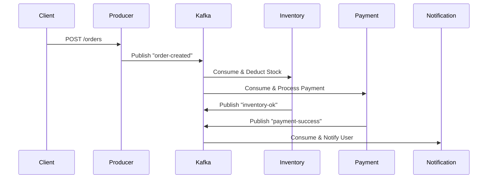

# Microservices with Kafka Cluster

This repository demonstrates a microservices architecture using Apache Kafka as a message broker in a clustered setup. It leverages Docker Compose to orchestrate a multi-broker Kafka cluster (in KRaft mode, without ZooKeeper) and Spring Boot-based microservices for event-driven communication. The example focuses on an order processing workflow where a frontend service receives client requests, publishes events to Kafka, and downstream services (e.g., inventory, payment, notification) consume and process them asynchronously.

Inspired by common tutorials (e.g., Amigoscode's microservices series), this setup ensures scalability, fault tolerance, and decoupled services.

## Features
- **Kafka Cluster**: 3-broker setup with KRaft for high availability and replication.
- **Microservices**: Spring Boot applications for producing and consuming Kafka events.
- **Event-Driven**: Asynchronous message passing via Kafka topics (e.g., `order-created`, `payment-processed`).
- **Dockerized**: Easy deployment with Docker Compose.
- **No ZooKeeper**: Modern KRaft mode for simplified operations.

## Prerequisites
- Docker and Docker Compose installed.
- Java 17+ (for building Spring Boot services, if modifying source).
- Basic knowledge of Kafka and Spring Boot.

## Repository Structure
Based on the analysis, the repository contains:
- **Root Files**:
  - `docker-compose.yml`: Defines Kafka brokers and microservices.
- **Folders**:
  - `frontend-service/` (or `order-service/`): Producer service (HTTP endpoint for client requests).
  - `inventory-service/`: Consumer for stock checks.
  - `payment-service/`: Consumer for payment processing.
  - `notification-service/`: Consumer for sending confirmations.
  - Each service folder includes: `Dockerfile`, `pom.xml` (Maven), `src/` (Java code), `application.yml` (Kafka/Spring config).
- **Configs**: Kafka topics created via commands (e.g., `order-events`, `inventory-deducted`).

## Quick Start
1. **Clone the Repository**:
   ```bash
   git clone https://github.com/sxidsvit/microservices-kafka-cluster.git
   cd microservices-kafka-cluster
   ```

2. **Start the Cluster**:
   ```bash
   docker-compose up -d
   ```
   This launches:
   - 3 Kafka brokers (`kafka-broker-1`, `-2`, `-3`) on ports 9094, 9095, 9096 (external).
   - Microservices as separate containers.

3. **Create Topics**:
   ```bash
   docker exec -it kafka-broker-1 kafka-topics.sh --create --topic order-created --bootstrap-server localhost:9092 --partitions 3 --replication-factor 3
   ```
   Repeat for other topics: `inventory-deducted`, `payment-processed`, etc., as needed.

4. **Test the System**:
   - Send a POST request to the producer service (e.g., `http://localhost:8080/orders` with JSON payload: `{"orderId": 1, "items": [...], "amount": 100}`).
   - Monitor logs: `docker-compose logs -f`.
   - Events flow: Producer → Kafka → Consumers (parallel processing).

5. **Stop the Cluster**:
   ```bash
   docker-compose down
   ```

## Kafka Configuration
The cluster uses KRaft mode for controller functionality. Key environment variables from `docker-compose.yml` (for `kafka-broker-1`; similar for others):

```yaml
services:
  kafka-broker-1:
    image: bitnami/kafka:latest
    environment:
      KAFKA_ENABLE_KRAFT: "yes"  # Enable KRaft mode
      KAFKA_CFG_NODE_ID: 1       # Unique broker ID
      KAFKA_CFG_PROCESS_ROLES: broker,controller  # Roles: broker + controller
      KAFKA_CFG_LISTENERS: PLAINTEXT://:9092,CONTROLLER://:9093,EXTERNAL://0.0.0.0:9094
      KAFKA_CFG_ADVERTISED_LISTENERS: PLAINTEXT://kafka-broker-1:9092,EXTERNAL://localhost:9094
      KAFKA_CFG_CONTROLLER_QUORUM_VOTERS: 1@kafka-broker-1:9093,2@kafka-broker-2:9093,3@kafka-broker-3:9093
      # ... (other security and listener configs)
```

- **Internal Communication**: Brokers talk on port 9092.
- **External Access**: Clients connect via `localhost:9094` (broker-1), etc.
- **Cluster ID**: `7Dvn0OLMQo-bg4qmCmflVg` (unique for the cluster).

## Microservices Overview
- **Producer (Frontend/Order Service)**: Exposes REST API, uses `KafkaTemplate` to publish JSON events to `order-created` topic.
- **Consumers**: Use `@KafkaListener` to process events, perform business logic (e.g., deduct stock, charge payment), and publish to next topics.
- **Serialization**: JSON via Spring Kafka.
- **Error Handling**: Dead Letter Queues (DLQ) for failed messages.

Example Spring Config (`application.yml` in services):
```yaml
spring:
  kafka:
    bootstrap-servers: localhost:9094,localhost:9095,localhost:9096
    producer:
      key-serializer: org.apache.kafka.common.serialization.StringSerializer
      value-serializer: org.springframework.kafka.support.serializer.JsonSerializer
    consumer:
      group-id: inventory-group  # Unique per service
      auto-offset-reset: earliest
      key-deserializer: org.apache.kafka.common.serialization.StringDeserializer
      value-deserializer: org.springframework.kafka.support.serializer.JsonDeserializer
```

## Workflow Diagram
Here's a simple sequence of message flow:

```
Client → Producer (HTTP POST /orders) → Kafka (order-created topic)
  ↓ (Async Fan-Out)
Inventory Service ← Kafka → Payment Service
  ↓ (If success)                  ↓
Kafka (inventory-deducted)    Kafka (payment-processed)
  ↓
Notification Service ← Kafka → Send Email/SMS
```

For a visual diagram, use tools like Draw.io or Mermaid:


## Scaling and Customization
- **Scale Services**: `docker-compose up -d --scale inventory-service=3`.
- **Add Topics/Partitions**: Use Kafka CLI to create additional topics or adjust partitions.
- **Security**: Add SSL/SASL by updating listener protocols.
- **Monitoring**: Integrate Prometheus + Grafana for metrics.

## Troubleshooting
- **Broker Not Starting**: Check Docker logs (`docker-compose logs kafka-broker-1`). Ensure ports 9092-9096 are free.
- **Connection Issues**: Verify `bootstrap-servers` in app configs match advertised listeners.
- **Topics Missing**: Run topic creation commands manually.
- **KRaft Errors**: Ensure consistent `KAFKA_KRAFT_CLUSTER_ID` across brokers.

## Contributing
1. Fork the repo.
2. Create a feature branch (`git checkout -b feature/amazing-feature`).
3. Commit changes (`git commit -m 'Add amazing feature'`).
4. Push to branch (`git push origin feature/amazing-feature`).
5. Open a Pull Request.


#### 🙏 Acknowledgements

A heartfelt thank you to [Lama Dev](https://www.youtube.com/@LamaDev/videos) for his invaluable contributions

---

_Built with ❤️ by [sxidsvit](https://github.com/sxidsvit)_

_Last updated: October 8, 2025_

---

*Built with ❤️ for learning microservices. Contributions welcome!*